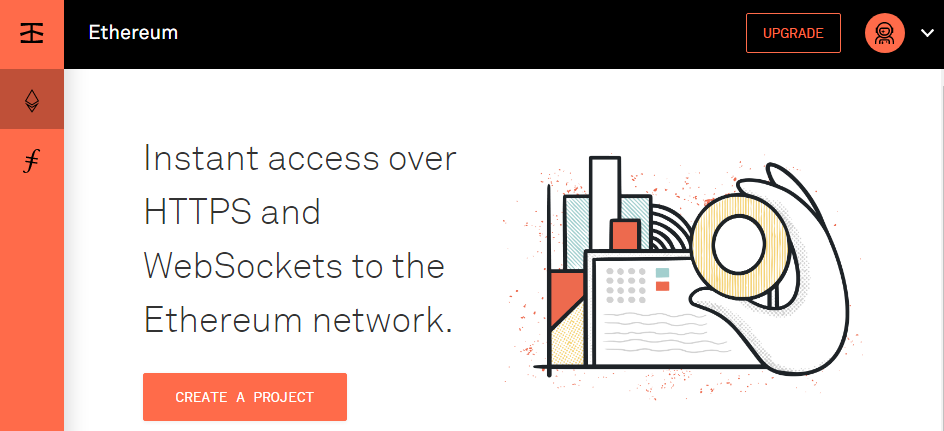
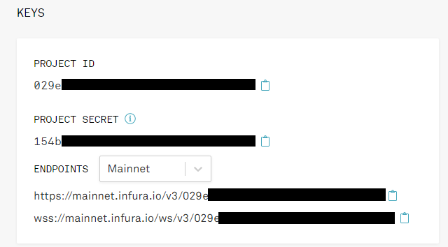
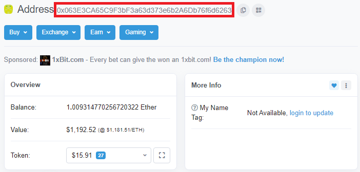

# Pythonでのethereum開発環境を作る

## Python環境の整備

### Pythonのバージョン確認

&emsp;はじめにPython3が正しくインストールされているか確認をしましょう．

```cmd
$ python --version
Python 3.X.X
```

もしくは

```cmd
& py --version
Python 3.X.X
```

&emsp;Python3がインストールされていることを確認しましょう．Python2は推奨されません．

### Web3.pyライブラリ

&emsp;pythonでWeb3.pyライブラリを扱うにはMicrosoft Visual C++ Build Toolsが必要です．[ここ](https://visualstudio.microsoft.com/ja/thank-you-downloading-visual-studio/?sku=BuildTools&rel=16)からインストーラーを入手しましょう．インストーラーを起動したら，C++ Build Toolにチェックを入れてインストールを開始しましょう．

&emsp;次のように，pipを利用してWeb3.pyライブラリをインストールしましょう．ターミナルから実行できます．

```cmd
$ pip install web3
Successfully installed...
```

もしくは

```cmd
$ pip3 install web3
Successfully installed...
```

### Infura

&emsp;Infuraは，リモートイーサリアムノードを無料で提供するサービスです．[ここ](https://infura.io/)にサインアップして，APIキーとRPCURLを取得しましょう．
&emsp;アカウントの作成が完了したら，【CREATE A PROJECR】を選択して，新しいプロジェクトを作成しましょう．

>

&emsp;プロジェクトを作成すると，keyが提供されます．

>

&emsp;これで必要なものは全て揃いました．次のステップでは実際にPythonを使ってコードを作成しましょう．

## コーディングチュートリアル

### 接続のテスト

&emsp;簡単なコーディングで，正しく接続されているかのテストを行いましょう．Infura API keyを初めに，任意の変数(今回はInfura_url)に割り当てておきましょう．

```python
from web3 import Web3

def main():
    #入手した自分のURLに差し替えて下さい．
    infura_url = "https://mainnet.infura.io/v3/YOUR_URL_HERE"

    #次のようにWeb3接続をインスタス化
    web3 = Web3(Web3.HTTPProvider(infura_url))

    #次のように接続されていることを確認できます．
    #正しく接続されている場合 True を返します．
    print(web3.isConnected())

    #次のように最新のブロック番号を確認できます．
    print(web3.eth.blockNumber)

if __name__ == "__main__":
    main()
```

### アカウント残金の確認方法

&emsp;[Etherscan](https://etherscan.io/)に登録されているアカウントの残金を取得することが可能です．サイト内で任意のユーザーのアカウントアドレスをコピーしておきましょう．



&emsp;次のコードでアカウントの残金を取得することができます．しかし，取得する残金はEthrtの下位区分であるweiであることに注意してください．(ドル→セントのような関係)

```python
from web3 import Web3

def main():
    #入手した自分のURLに差し替えて下さい．
    infura_url = "https://mainnet.infura.io/v3/YOUR_URL_HERE"

    #次のようにWeb3接続をインスタス化
    web3 = Web3(Web3.HTTPProvider(infura_url))

    #次のように接続されていることを確認できます．
    print(web3.isConnected())

    #コピーしたアドレスを変数に格納します．
    address = "0x063E3CA65C9F3bF3a63d373e6b2A6Db76f6d6263"

    #次のように残金を入手します
    balance = web3.eth.getBalance(address)
    print(balance)

if __name__ == "__main__":
    main()
```

&emsp;この値はEtherに変換するには，10 ** 18で割る必要があります．または，fromWei関数を扱うことによって，変換することができます．次のコードはfromWei関数を行うことによって，変換を行っているものです．

```python
from web3 import Web3

def main():
    #入手した自分のURLに差し替えて下さい．
    infura_url = "https://mainnet.infura.io/v3/YOUR_URL_HERE"

    #次のようにWeb3接続をインスタス化
    web3 = Web3(Web3.HTTPProvider(infura_url))

    #次のように接続されていることを確認できます．
    print(web3.isConnected())

    #コピーしたアドレスを変数に格納します．
    address = "0x063E3CA65C9F3bF3a63d373e6b2A6Db76f6d6263"

    #次のように残金を入手します
    balance = web3.eth.getBalance(address)

    #単位を変換します
    balance = web3.fromWei(balance, 'ether')
    print(balance)

if __name__ == "__main__":
    main()
```

## web3.pyでスマートコンストラクタからデータ読取

&emsp;web3.eth.Contract()関数を仕様することで，EthereumスマートコンストラクトのPython表現を取得できます．この関数には2つの引数を必要とします．
&emsp;引数のうち1つはスマートコンストラクトABI(AbstractBinaryLnterface)で，特定のスマートコンストラクトがどのように機能するかを説明しているJSON配列です．次はその一例です．

```python
abi = [{"constant":true,"inputs":[],"name":"mintingFinished","outputs":[{"name":"","type":"bool"}],"payable":false,"type":"function"},{"constant":true,"inputs":[],"name":"name","outputs":[{"name":"","type":"string"}],"payable":false,"type":"function"},{"constant":false,"inputs":[{"name":"_spender","type":"address"},{"name":"_value","type":"uint256"}],"name":"approve","outputs":[],"payable":false,"type":"function"},{"constant":true,"inputs":[],"name":"totalSupply","outputs":[{"name":"","type":"uint256"}],"payable":false,"type":"function"},{"constant":false,"inputs":[{"name":"_from","type":"address"},{"name":"_to","type":"address"},{"name":"_value","type":"uint256"}],"name":"transferFrom","outputs":[],"payable":false,"type":"function"},{"constant":true,"inputs":[],"name":"decimals","outputs":[{"name":"","type":"uint256"}],"payable":false,"type":"function"},{"constant":false,"inputs":[],"name":"unpause","outputs":[{"name":"","type":"bool"}],"payable":false,"type":"function"},{"constant":false,"inputs":[{"name":"_to","type":"address"},{"name":"_amount","type":"uint256"}],"name":"mint","outputs":[{"name":"","type":"bool"}],"payable":false,"type":"function"},{"constant":true,"inputs":[],"name":"paused","outputs":[{"name":"","type":"bool"}],"payable":false,"type":"function"},{"constant":true,"inputs":[{"name":"_owner","type":"address"}],"name":"balanceOf","outputs":[{"name":"balance","type":"uint256"}],"payable":false,"type":"function"},{"constant":false,"inputs":[],"name":"finishMinting","outputs":[{"name":"","type":"bool"}],"payable":false,"type":"function"},{"constant":false,"inputs":[],"name":"pause","outputs":[{"name":"","type":"bool"}],"payable":false,"type":"function"},{"constant":true,"inputs":[],"name":"owner","outputs":[{"name":"","type":"address"}],"payable":false,"type":"function"},{"constant":true,"inputs":[],"name":"symbol","outputs":[{"name":"","type":"string"}],"payable":false,"type":"function"},{"constant":false,"inputs":[{"name":"_to","type":"address"},{"name":"_value","type":"uint256"}],"name":"transfer","outputs":[],"payable":false,"type":"function"},{"constant":false,"inputs":[{"name":"_to","type":"address"},{"name":"_amount","type":"uint256"},{"name":"_releaseTime","type":"uint256"}],"name":"mintTimelocked","outputs":[{"name":"","type":"address"}],"payable":false,"type":"function"},{"constant":true,"inputs":[{"name":"_owner","type":"address"},{"name":"_spender","type":"address"}],"name":"allowance","outputs":[{"name":"remaining","type":"uint256"}],"payable":false,"type":"function"},{"constant":false,"inputs":[{"name":"newOwner","type":"address"}],"name":"transferOwnership","outputs":[],"payable":false,"type":"function"},{"anonymous":false,"inputs":[{"indexed":true,"name":"to","type":"address"},{"indexed":false,"name":"value","type":"uint256"}],"name":"Mint","type":"event"},{"anonymous":false,"inputs":[],"name":"MintFinished","type":"event"},{"anonymous":false,"inputs":[],"name":"Pause","type":"event"},{"anonymous":false,"inputs":[],"name":"Unpause","type":"event"},{"anonymous":false,"inputs":[{"indexed":true,"name":"owner","type":"address"},{"indexed":true,"name":"spender","type":"address"},{"indexed":false,"name":"value","type":"uint256"}],"name":"Approval","type":"event"},{"anonymous":false,"inputs":[{"indexed":true,"name":"from","type":"address"},{"indexed":true,"name":"to","type":"address"},{"indexed":false,"name":"value","type":"uint256"}],"name":"Transfer","type":"event"}]
```

&emsp;これは本当に長い配列です．この例は，ERC-20トークン標準を実装するOmiseGOトークンのABIです．この標準に慣れたい場合は，[このビデオ](https://www.youtube.com/watch?v=W0Lomo8CdTM)を見てください．今回のサンプルコードではこのスマートコンストラクトABIを使用します．
